# Asset Management — End User Guide

**Version 1.0.0.15** · July 2026

This guide explains how to use Asset Management in Microsoft 365 SharePoint Online and Microsoft Teams. Screenshots were captured from the live app at:

`https://chronodat.sharepoint.com/sites/ChronodatProdApps/spfx`

---

## Screenshot index

| File | Shows |
|------|-------|
| [01-dashboard.png](user-guide/images/01-dashboard.png) | Dashboard — KPI cards and charts |
| [02-all-assets.png](user-guide/images/02-all-assets.png) | All Assets register with search and filters |
| [03-assigned-to-me.png](user-guide/images/03-assigned-to-me.png) | Assets assigned to the signed-in user |
| [04-available-assets.png](user-guide/images/04-available-assets.png) | Assets available for assignment |
| [05-assign-asset.png](user-guide/images/05-assign-asset.png) | Assign Asset operation |
| [06-return-asset.png](user-guide/images/06-return-asset.png) | Return Asset operation |
| [07-book-asset.png](user-guide/images/07-book-asset.png) | Book Asset for temporary use |
| [08-request-asset.png](user-guide/images/08-request-asset.png) | Request a new asset |
| [09-scan-asset.png](user-guide/images/09-scan-asset.png) | Scan barcode or QR label |
| [10-inventory.png](user-guide/images/10-inventory.png) | Record physical inventory scans |
| [11-software-licenses.png](user-guide/images/11-software-licenses.png) | Software license tracking |
| [12-maintenance.png](user-guide/images/12-maintenance.png) | Maintenance records |
| [13-reports.png](user-guide/images/13-reports.png) | Report Builder |
| [14-depreciation.png](user-guide/images/14-depreciation.png) | Depreciation schedules |
| [15-audit-log.png](user-guide/images/15-audit-log.png) | Audit trail |
| [16-categories.png](user-guide/images/16-categories.png) | Categories lookup list |
| [17-vendors.png](user-guide/images/17-vendors.png) | Vendors lookup list |
| [18-locations.png](user-guide/images/18-locations.png) | Locations lookup list |
| [19-settings-general.png](user-guide/images/19-settings-general.png) | Settings → General |
| [20-settings-appearance.png](user-guide/images/20-settings-appearance.png) | Settings → Appearance |
| [21-settings-forms.png](user-guide/images/21-settings-forms.png) | Settings → Forms |
| [22-settings-tags.png](user-guide/images/22-settings-tags.png) | Settings → Tags |
| [23-settings-subscription.png](user-guide/images/23-settings-subscription.png) | Settings → Subscription |
| [24-settings-roles.png](user-guide/images/24-settings-roles.png) | Settings → Roles & Permissions |

## 1. Getting started

### 1.1 Add the web part and run setup

1. Open your SharePoint site and edit a modern page.
2. Click **+** to add a web part and search for **Asset Management**.
3. Publish the page and open it as a site owner.
4. Click **Complete Setup** on the banner. Wait until all SharePoint lists are provisioned.
5. Open **Settings → General** to set the app display name.

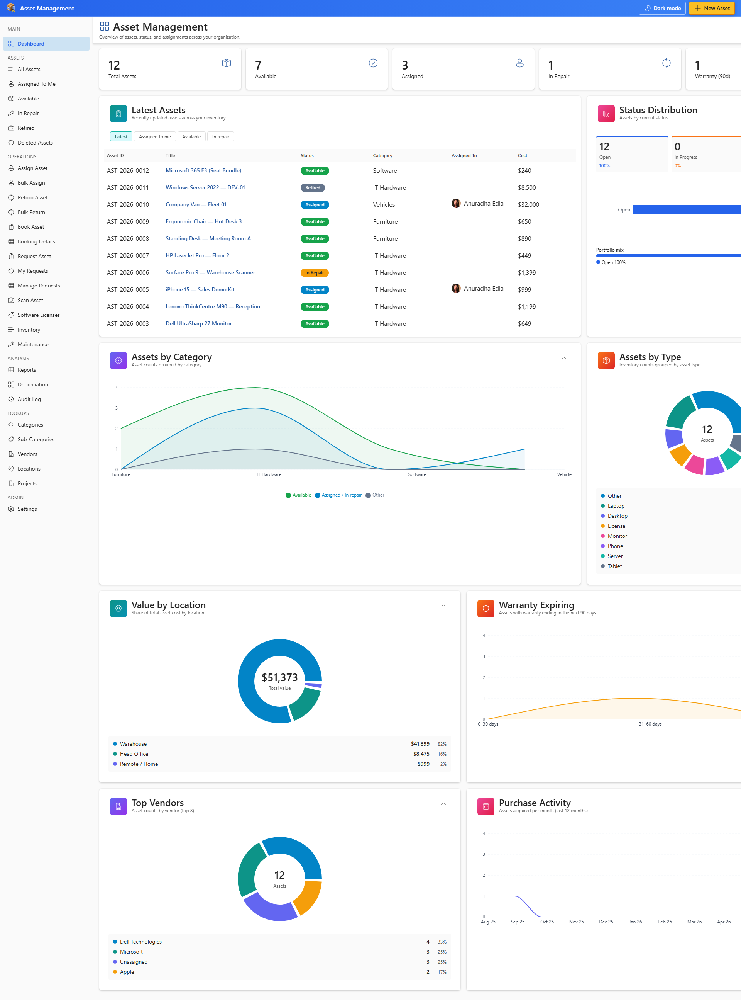

## 2. Dashboard

### 2.1 Review asset KPIs

1. Open **Dashboard** from the sidebar MAIN section.
2. Review summary cards for total assets, assigned, available, and overdue items.
3. Use charts to see distribution by status, category, and location.
4. Click a card or chart segment to drill into the matching asset list.

## 3. Asset register

### 3.1 Browse and search assets

1. Open **All Assets** from the ASSETS section.
2. Use the search box to find assets by ID, title, serial number, or tag.
3. Switch between table, list, and card views.
4. Apply filters for status, category, location, or assigned user.
5. Click **Create Asset** (or **New Asset**) to add a new item.

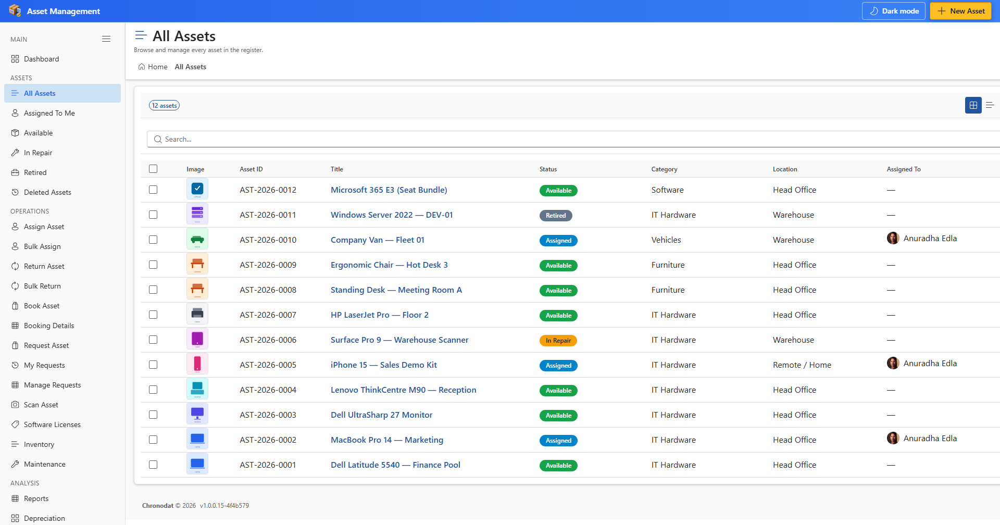

## 3. Asset register

### 3.2 Create or edit an asset

1. Click **Create Asset** or open an asset title from any list.
2. On the **General** tab, enter Title, Category, Status, and other required fields.
3. Complete **Financial**, **Assignment**, and **Maintenance** tabs as needed.
4. If the category has a linked form template, fill in the extra fields shown below the main tabs.
5. Add attachments in the attachments section.
6. Open the **Activity** tab on an existing asset to view SharePoint version history.
7. Click **Save** to persist changes.

## 3. Asset register

### 3.3 Filtered asset views

1. **Assigned To Me** — assets where you are the custodian.
2. **Available** — assets ready to assign or book.
3. **In Repair** / **Retired** / **Deleted Assets** — lifecycle-specific views.

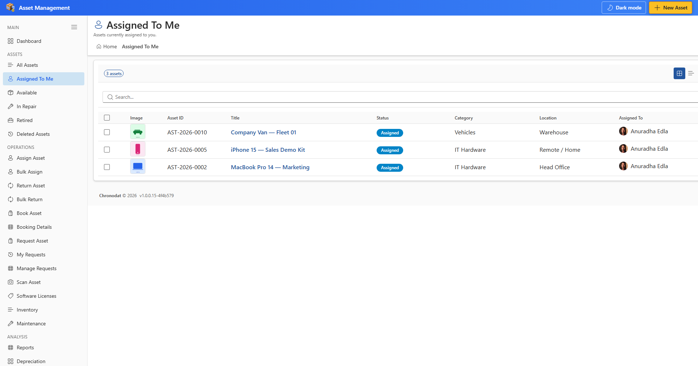

## 4. Operations

### 4.1 Assign an asset

1. Open **Assign Asset** from the OPERATIONS section.
2. Search for the asset by ID, title, or scan label.
3. Select the person to assign to and set optional notes or due date.
4. Click **Assign** to complete the assignment.

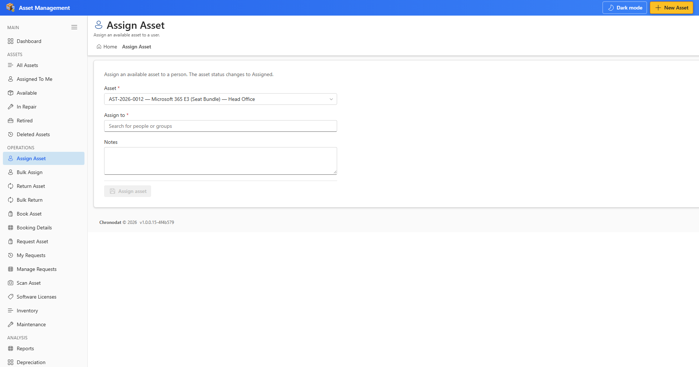

## 4. Operations

### 4.2 Return an asset

1. Open **Return Asset**.
2. Find the assigned asset and confirm the return condition.
3. Click **Return** to mark the asset as available again.

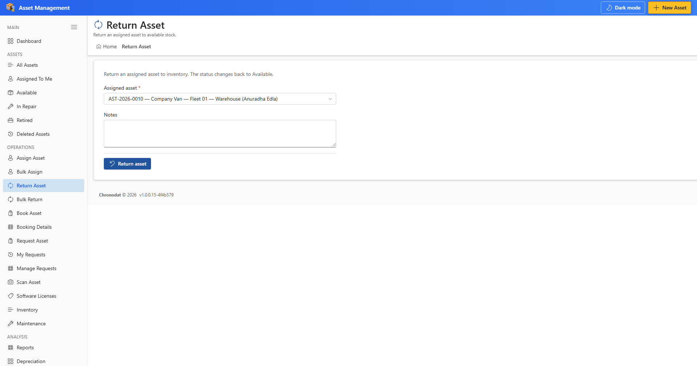

## 4. Operations

### 4.3 Book and request assets

1. **Book Asset** — reserve an asset for a date range.
2. **Request Asset** — submit a request when you need equipment.
3. **My Requests** / **Manage Requests** — track and approve requests.

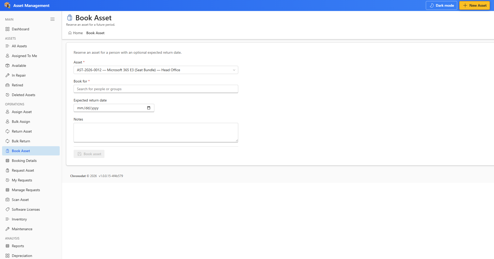

## 4. Operations

### 4.4 Scan and inventory

1. Open **Scan Asset** and enter or scan a barcode/QR label to locate an asset.
2. Open **Inventory** to record a physical scan during an inventory cycle.
3. Enter a value in **Scan label** before **Record scan** becomes active.

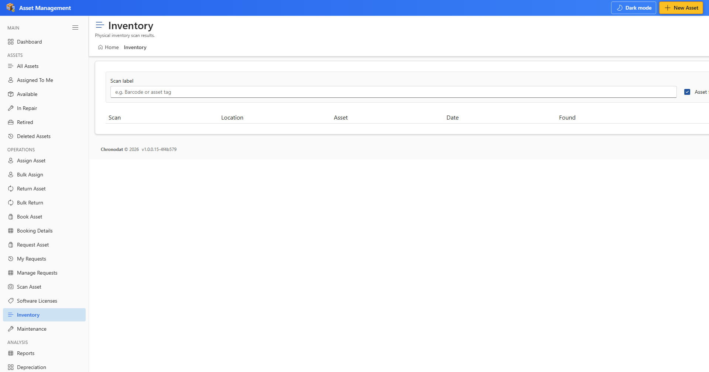

## 5. Licenses and maintenance

### 5.1 Software licenses

1. Open **Software Licenses** to track license seats and assignments.
2. Add licenses with vendor, seat count, and renewal dates.
3. Link license usage to assets or users as your process requires.

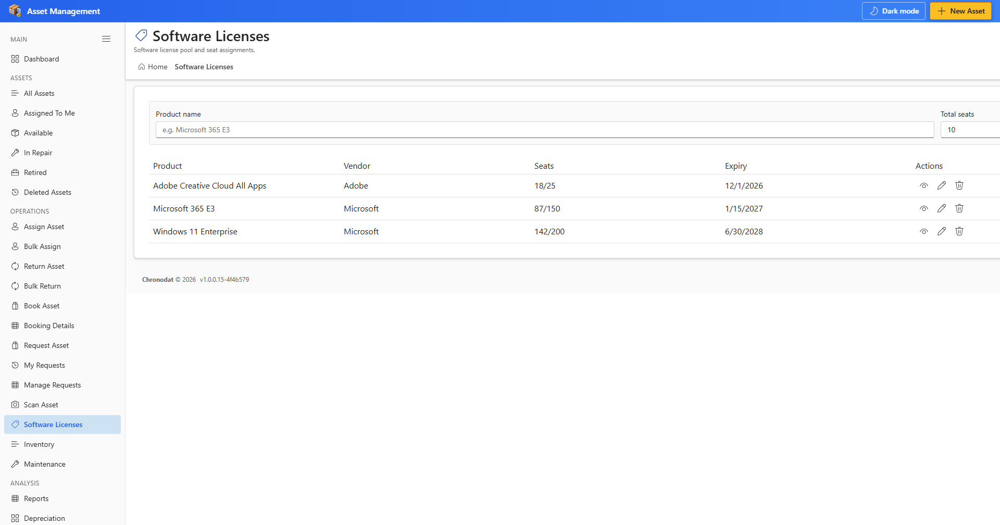

## 5. Licenses and maintenance

### 5.2 Maintenance

1. Open **Maintenance** to log repairs, inspections, and service schedules.
2. Create maintenance records linked to assets.

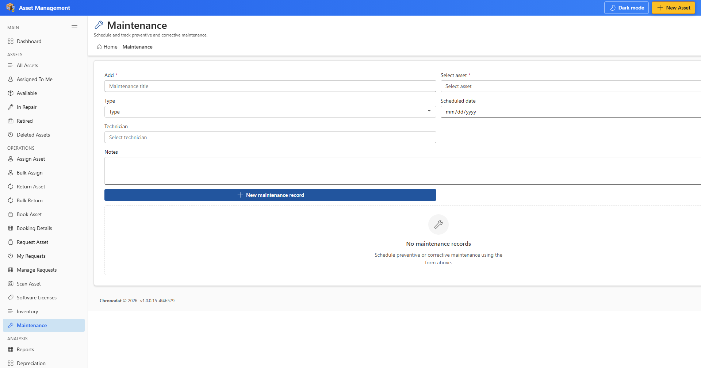

## 6. Analysis and reporting

### 6.1 Report Builder

1. Open **Reports** from the ANALYSIS section.
2. Choose a data source (Assets, Vendors, Locations, etc.).
3. Select columns and optional filters.
4. Click **Generate Report** to preview, then **Download CSV** to export.

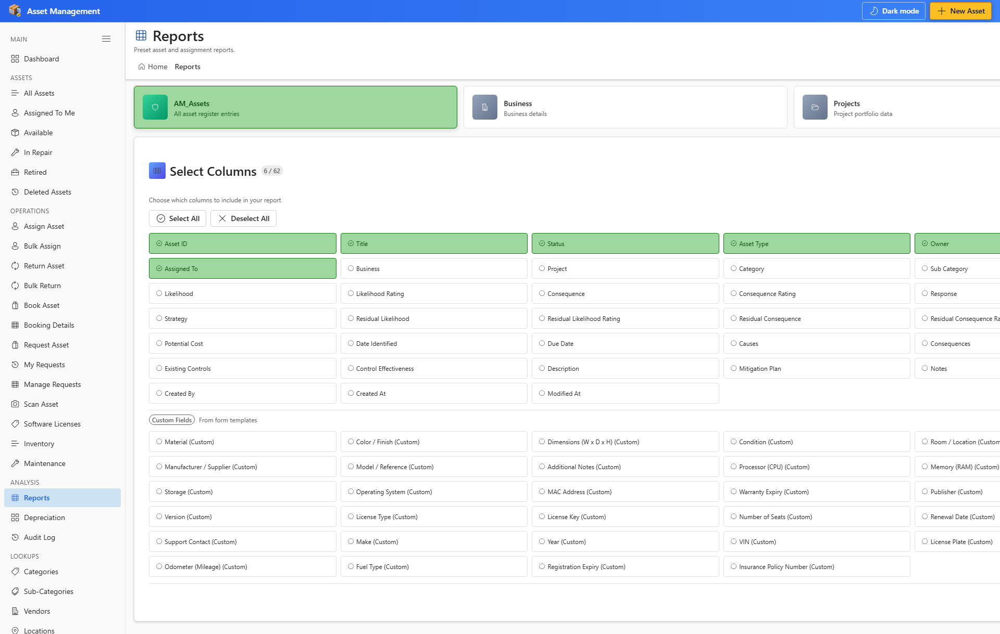

## 6. Analysis and reporting

### 6.2 Depreciation and audit

1. **Depreciation** — review depreciation schedules configured on assets.
2. **Audit Log** — search create, update, and delete actions across the app.

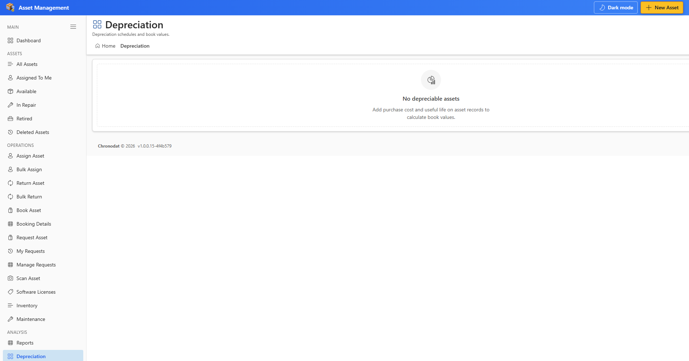

## 7. Lookup lists

### 7.1 Master data

1. Use **Categories**, **Sub-Categories**, **Vendors**, **Locations**, and **Projects** in the LOOKUPS section to maintain reference data.
2. Click **Add new**, complete fields, and **Save**.
3. Lookup values appear in asset forms and filters.

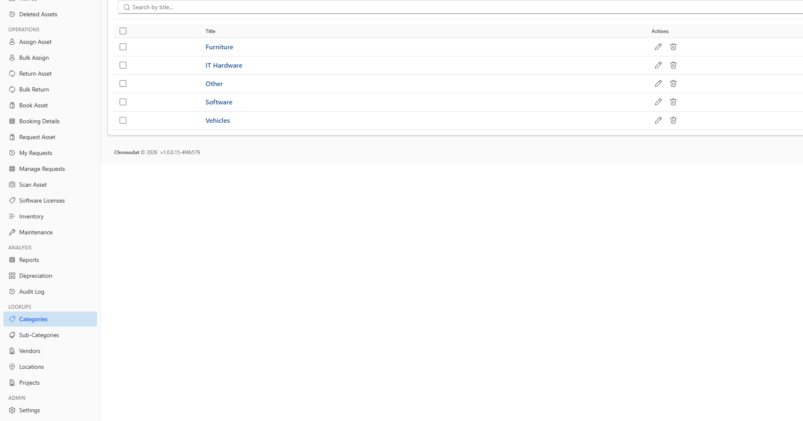

## 8. Settings (administrators)

### 8.1 General configuration

1. Open **Settings** from the ADMIN section (site owners and app administrators only).
2. **General** — app display name and header links.
3. **Appearance** — theme, colors, and layout.
4. **Forms** — field visibility per list (AM_Assets, AM_Vendors, etc.).
5. **Tags** — colored tags for filtering assets.
6. **Subscription** — 14-day trial and yearly licensing.
7. **Roles & Permissions** — assign app roles and UI permissions.

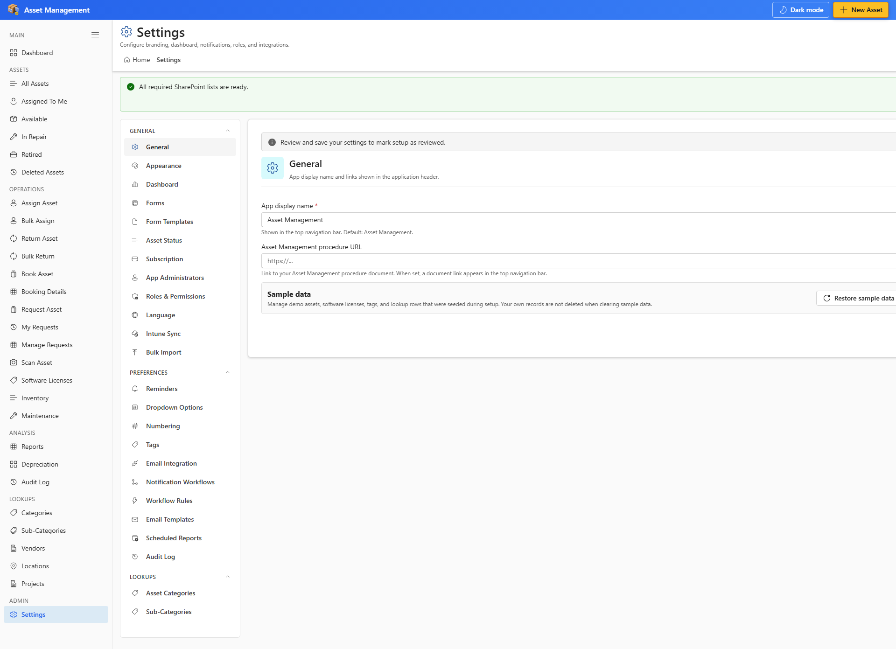

## 9. Tips and troubleshooting

### 9.1 Common issues

1. **Setup banner** — run Complete Setup as site owner.
2. **Settings not visible** — ask an app administrator to add you under App Administrators.
3. **Record scan disabled** — enter text in Scan label first.
4. **Email notifications** — tenant admin must approve Microsoft Graph Mail.Send.

---

*Generated for Asset Management v1.0.0.15. Refresh screenshots: `npm run docs:user-guide:all`*
