# Asset Management — End-to-End Process Flow

This document describes the complete lifecycle of the **Asset Management** SharePoint Framework (SPFx) solution: from tenant deployment through daily operations, analysis, and administration.

**Platform:** SharePoint Online · Microsoft Teams · M365  
**Solution version:** SPFx 1.21.1  
**Infographics:** [`assets/docs/process-flow/`](../assets/docs/process-flow/)

---

## Table of contents

1. [Executive summary](#1-executive-summary)
2. [Deployment & onboarding](#2-deployment--onboarding)
3. [App bootstrap & subscription gate](#3-app-bootstrap--subscription-gate)
4. [First-time setup (provisioning)](#4-first-time-setup-provisioning)
5. [SharePoint data architecture](#5-sharepoint-data-architecture)
6. [Daily user journey](#6-daily-user-journey)
7. [Asset lifecycle](#7-asset-lifecycle)
8. [Operations workflows](#8-operations-workflows)
9. [Analysis & reporting](#9-analysis--reporting)
10. [Administration & settings](#10-administration--settings)
11. [Optional integrations](#11-optional-integrations)
12. [Release & store pipeline](#12-release--store-pipeline)

---

## 1. Executive summary

Asset Management is a client-side SPFx application that runs inside SharePoint Online (or as a Teams tab). All business data lives in SharePoint lists on the host site. The app never stores asset records in external databases.

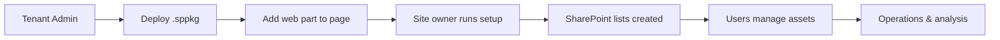

| Phase | Actor | Outcome |
|-------|-------|---------|
| Deploy | Tenant / SharePoint admin | Solution in App Catalog |
| Onboard | Site owner | 13+ lists provisioned, form registered |
| Operate | All permitted users | CRUD assets, assign, book, return |
| Analyze | Power users / admins | Reports, depreciation, audit log |
| Govern | Site owner | Settings, lookups, subscription |

---

## 2. Deployment & onboarding

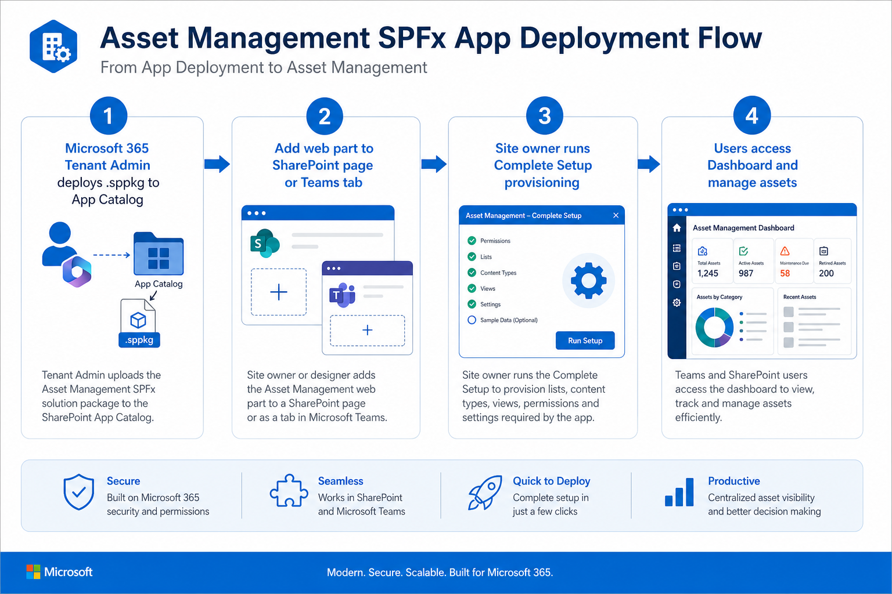

### 2.1 Build & package (publisher)

| Step | Action | Command / output |
|------|--------|-------------------|
| 1 | Bump version | `config/package-solution.json → solution.version` |
| 2 | Production build | `npm run ship` |
| 3 | Output | `sharepoint/solution/asset-management.sppkg` |
| 4 | Pre-upload checks | `npm run verify:version`, `verify:display-name`, `verify:store` |

### 2.2 Tenant deployment

| Step | Actor | Action |
|------|-------|--------|
| 1 | SharePoint admin | Upload `.sppkg` to **Tenant App Catalog** (or site collection catalog) |
| 2 | SharePoint admin | Deploy the app; approve API permissions if prompted (Graph `Mail.Send` for email notifications) |
| 3 | Site owner | Add the **Asset Management** web part to a modern SharePoint page (full-width recommended) |
| 4 | Site owner | Optionally pin the page as a **Teams tab** using the unified M365 manifest (`m365/manifest.json`) |

**Recommendation:** Use a dedicated subsite (e.g. `/sites/YourSite/AssetManagement`) so lists stay isolated from the root team site.

### 2.3 Web part configuration

Configure these properties in the web part pane:

| Property | Purpose |
|----------|---------|
| Subscription API URL | Enables 14-day trial + yearly subscription gating |
| Skip subscription check | Dev/local only (`config/serve.json`) |

---

## 3. App bootstrap & subscription gate

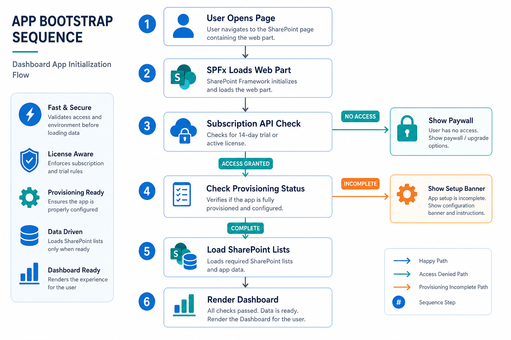

When a user opens the page, the main web part (`AssetManagement.tsx`) runs this sequence:

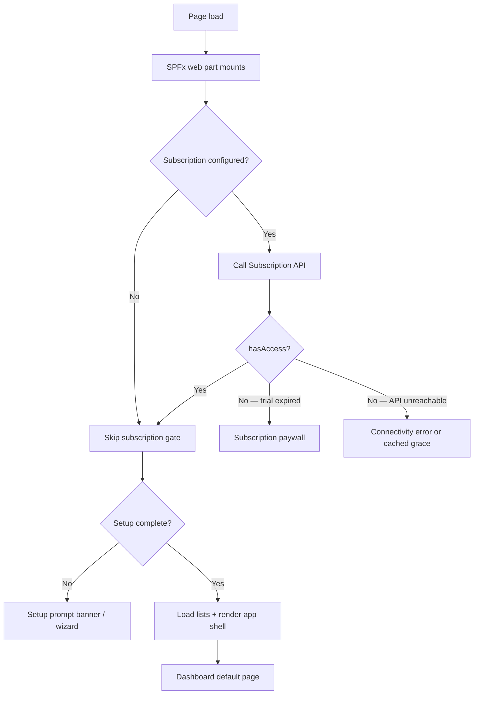

### Subscription states

| Status | User experience |
|--------|-----------------|
| **Trialing** | Full access; trial banner with days remaining |
| **Active** | Full access; billing portal in Settings |
| **Expired / none** | Paywall blocks app (Settings still reachable for admins) |
| **API offline** | Cached status used within grace window; otherwise connectivity error |

Subscription context includes tenant ID, site URL, site ID, user email, and product slug. Checkout and billing portal redirect to the hosted subscription service.

---

## 4. First-time setup (provisioning)

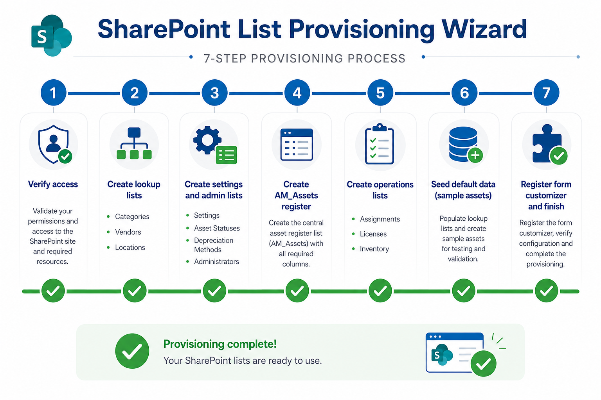

A **site owner** clicks **Complete Setup** (banner) or **Settings → Run setup**. The `ListProvisioningService.provisionAll()` method executes seven steps:

| # | Step ID | What happens |
|---|---------|--------------|
| 1 | `check` | Verify site-owner access; detect existing lists |
| 2 | `lookup` | Create lookup lists: categories, sub-categories, asset types, statuses, vendors, models, locations, projects, roles, audit log |
| 3 | `settings` | Create app settings, administrators, license records |
| 4 | `assets` | Create **AM_Assets** register with all tracking fields |
| 5 | `operations` | Create assignments, software licenses, maintenance, inventory (requires AM_Assets to exist first) |
| 6 | `seed` | Seed default lookup values and optional sample assets |
| 7 | `ready` | Register SPFx form customizer on AM_Assets; hide system lists from Site Contents |

On success:

- Provisioning completion is stored in browser local storage (scoped by tenant + site + user).
- The app loads settings, lookups, and assets in parallel.
- Users land on the **Dashboard**.

**Permissions required:** Site owner (full control) for initial setup.

---

## 5. SharePoint data architecture

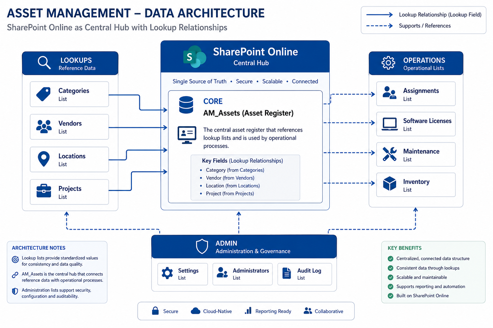

All persistence is SharePoint REST against lists on the host web.

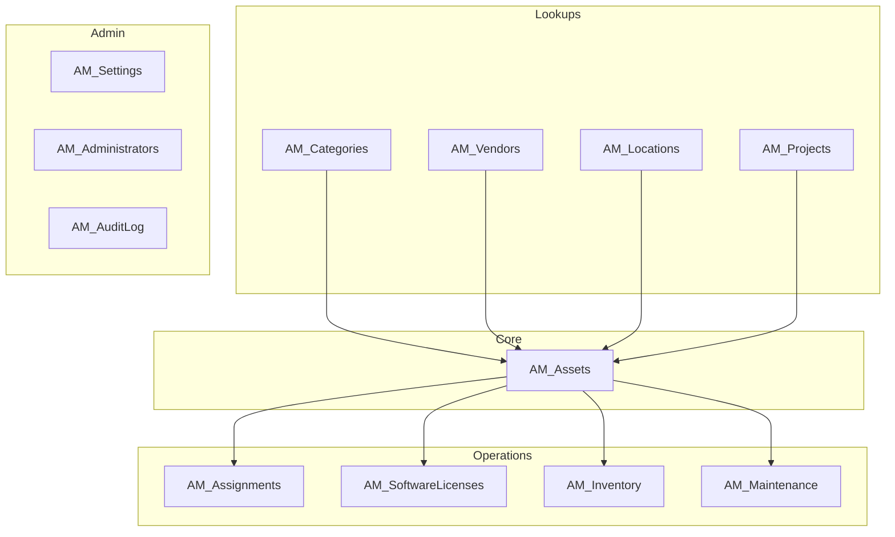

| List group | Key lists | Purpose |
|------------|-----------|---------|
| Lookups | Categories, Vendors, Locations, Projects | Reference data for asset forms and filters |
| Core | AM_Assets | Master asset register |
| Operations | Assignments, Software Licenses, Inventory, Maintenance | Transactions and related records |
| Admin | Settings, Administrators, Audit Log | Configuration and change history |

The **form customizer** extension (`assetFormCustomizer`) replaces the native SharePoint new/edit form for AM_Assets with the app's dynamic asset form.

---

## 6. Daily user journey

After setup, users interact through the app shell (`AssetManagementShell` + sidebar navigation).

### 6.1 Navigation map

| Section | Pages | Purpose |
|---------|-------|---------|
| **Main** | Dashboard | KPIs, charts, portfolio filters, quick actions |
| **Assets** | All Assets, Assigned To Me, Available, In Repair, Retired, Deleted | Filtered views of AM_Assets |
| **Operations** | Assign, Return, Book, Booking Details, Software Licenses, Inventory | Day-to-day asset handling |
| **Analysis** | Reports, Depreciation, Audit Log | Insights and compliance trail |
| **Lookups** | Categories, Vendors, Locations, Projects | Manage reference data |
| **Admin** | Settings | Site-owner configuration (hidden from non-owners) |

### 6.2 Typical day for an asset coordinator

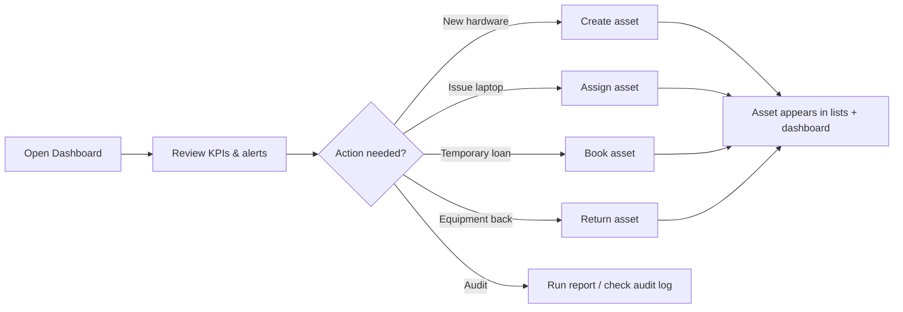

### 6.3 Creating & editing assets

1. Click **Create Asset** (top bar) or open an asset from any list view.
2. `AssetFormPanel` loads category-specific form templates from settings.
3. On save, `AssetService` writes to **AM_Assets** via SharePoint REST.
4. `AuditService` logs the change to **AM_AuditLog** (non-blocking).
5. Dashboard and filtered views refresh on next data load.

---

## 7. Asset lifecycle

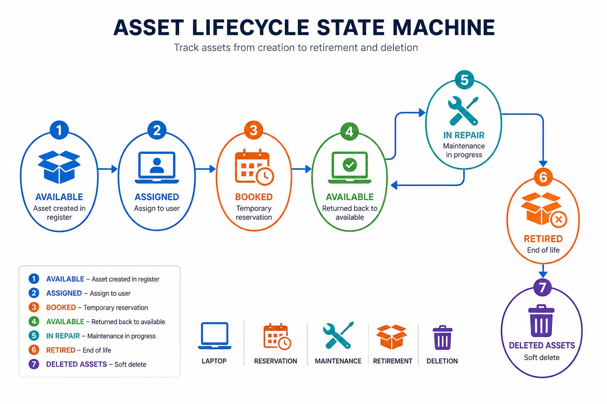

### Status model

Assets carry an **AM_Status** value (configurable in Settings). Default states include:

| Status | Meaning | Typical next states |
|--------|---------|---------------------|
| **Available** | In stock, unassigned | Assigned, Booked, In Repair |
| **Assigned** | Checked out to a user | Returned → Available, In Repair |
| **In Repair** | Under maintenance | Available, Retired |
| **Retired** | End of useful life | Deleted (soft) |
| **Deleted** | Soft-deleted (`AM_IsDeleted`) | Restored or purged via admin |

### Lifecycle diagram

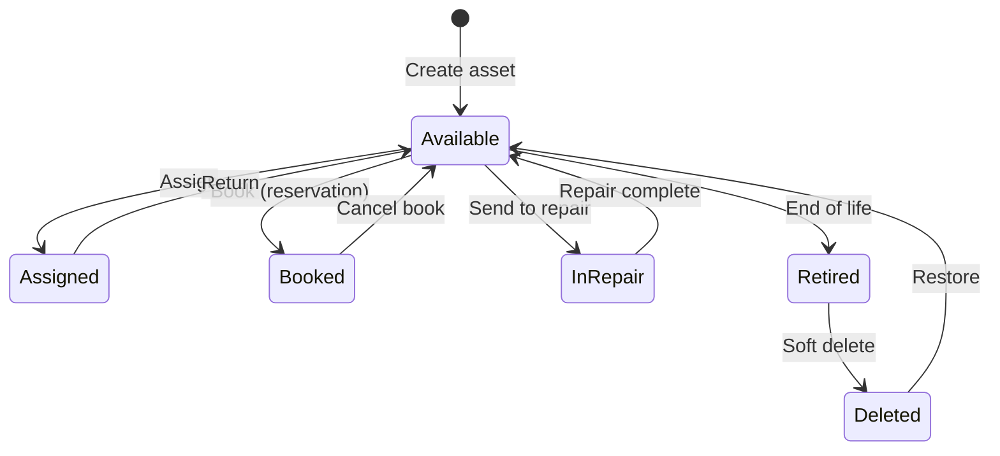

---

## 8. Operations workflows

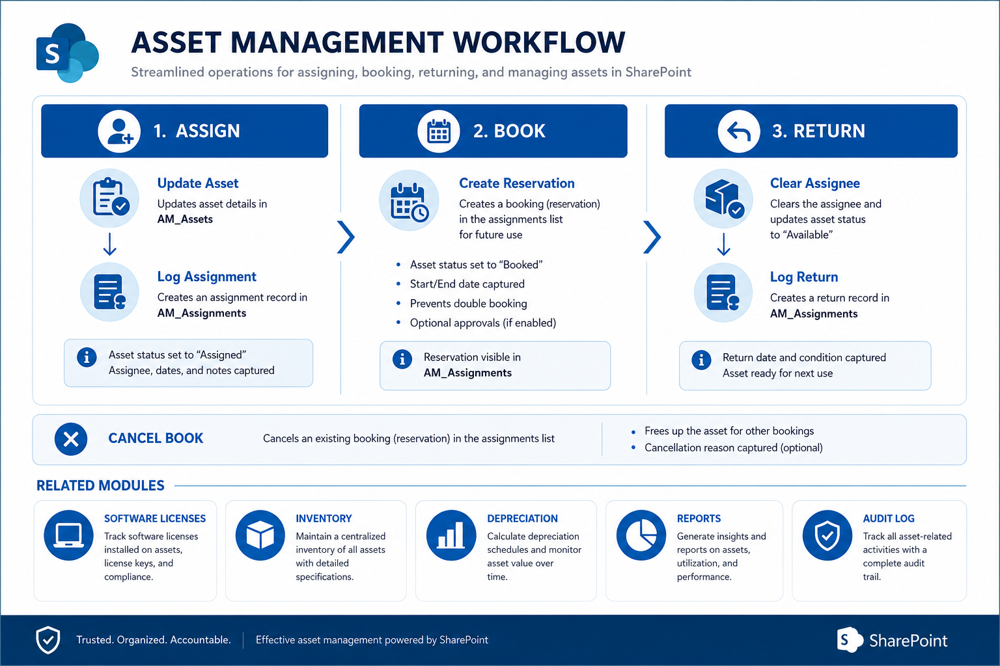

All assignment actions write to **AM_Assignments** (transaction log) and may update **AM_Assets**.

### 8.1 Assign asset

| Step | System behavior |
|------|-----------------|
| 1 | User selects an **Available** asset and assignee (person picker) |
| 2 | `AssignmentService.assignAsset()` updates AM_Assets: `AM_AssignedTo`, `AM_Status = Assigned`, `AM_AssignedDate` |
| 3 | New row in AM_Assignments with `AM_Action = Assign` |
| 4 | Optional acknowledgement email (requires Graph Mail.Send approval) |

### 8.2 Book asset (temporary reservation)

| Step | System behavior |
|------|-----------------|
| 1 | User selects bookable asset, requester, optional expected return date |
| 2 | Row added to AM_Assignments with `AM_Action = Book` |
| 3 | Asset status may remain Available until physically assigned |
| 4 | **Booking Details** page lists active reservations |
| 5 | **Cancel Book** sets `AM_Action = CancelBook` on the assignment row |

### 8.3 Return asset

| Step | System behavior |
|------|-----------------|
| 1 | User selects a returnable (assigned) asset |
| 2 | `AssignmentService.returnAsset()` clears assignee on AM_Assets, sets status back to Available |
| 3 | New AM_Assignments row with `AM_Action = Return` and actual return date |

### 8.4 Software licenses

Managed on **Software Licenses** page via `SoftwareLicenseService`:

- Track product, vendor, total/used/available seats, expiry, cost.
- Linked to vendors lookup list.

### 8.5 Inventory scans

`InventoryService` records physical inventory events:

- Location, scan date, scanned-by user, asset found/variance notes.
- Supports audit and reconciliation against the register.

### 8.6 Maintenance

Maintenance records (preventive, corrective, inspection) link to assets via **AM_Maintenance** list. Status transitions to **In Repair** are typically manual or workflow-driven.

---

## 9. Analysis & reporting

| Feature | Service | Output |
|---------|---------|--------|
| **Dashboard** | `dashboardAnalytics` utils | KPI cards, charts, heatmaps, portfolio filters |
| **Reports** | `ReportBuilderService` | Custom column reports from assets and related data |
| **Depreciation** | `DepreciationService` | Straight-line and declining-balance calculations |
| **Audit Log** | `AuditService` | Immutable-style change log (create/update/delete) |

Portfolio filters (business / project) persist per site in browser storage and apply across dashboard and asset views.

---

## 10. Administration & settings

Site owners access **Settings** (sidebar, Admin section).

| Tab / area | Capabilities |
|------------|--------------|
| **General** | App display name, procedure link URL |
| **Appearance** | Theme, dark mode, hide SharePoint chrome |
| **Form templates** | Category-specific dynamic forms |
| **Statuses & choices** | Customize asset status labels |
| **Administrators** | App admin roster (subscription banner actions) |
| **Subscription** | Trial status, checkout, billing portal |
| **Import / Export** | CSV bulk import and export of assets |
| **Intune sync** | Pull managed devices into AM_Assets (Graph-powered) |
| **Setup** | Re-run provisioning, clear seed data |

### Email notifications

Assignment acknowledgements require **Microsoft Graph Mail.Send** permission approved in SharePoint admin center. A banner in Settings prompts admins until approval is granted.

---

## 11. Optional integrations

### 11.1 Microsoft Intune sync

`IntuneSyncService.syncManagedDevices()`:

1. Fetches managed devices from Microsoft Graph (Settings UI).
2. Matches by `AM_IntuneDeviceId` or serial number.
3. Creates or updates AM_Assets with hardware/OS fields.

### 11.2 Import / export

`ImportExportService`:

- **Export:** CSV of core asset fields (Title, Asset ID, serial, barcode, cost, purchase date, notes).
- **Import:** Bulk create assets from CSV rows.

### 11.3 Teams & M365

- **Teams manifest** (`teams/manifest.json`) packages the app for Teams app store / org catalog.
- **M365 unified manifest** enables cross-surface deployment.

---

## 12. Release & store pipeline

End-to-end publisher flow for Microsoft commercial marketplace:

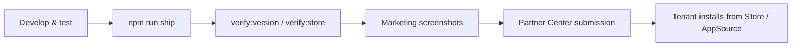

| Gate | Command |
|------|---------|
| Lint | `npm run lint` |
| Unit tests | `npm test` |
| Version sync | `npm run verify:version` |
| Display name | `npm run verify:display-name` |
| Store assets | `npm run assets:sppkg`, `npm run assets:marketing:crops` |
| Store readiness | `npm run verify:store` |
| E2E (tenant) | Playwright with `PLAYWRIGHT_BASE_URL` |

Before submission: set real MPN ID in `config/publisher.json`, run `npm run sync:publisher`, produce final `.sppkg` with `npm run ship`.

---

## Appendix A — Complete process flow (single reference)

```
┌─────────────────────────────────────────────────────────────────────────────┐
│                        END-TO-END PROCESS FLOW                              │
├─────────────────────────────────────────────────────────────────────────────┤
│ PUBLISHER                                                                    │
│   Build (npm run ship) → Verify → Upload .sppkg → Partner Center / Store   │
├─────────────────────────────────────────────────────────────────────────────┤
│ TENANT ADMIN                                                                 │
│   Deploy to App Catalog → Approve Graph permissions → Notify site owners    │
├─────────────────────────────────────────────────────────────────────────────┤
│ SITE OWNER — ONBOARDING                                                      │
│   Add web part → Configure subscription URL → Complete Setup (7 steps)      │
│   → Optional: Import CSV, Intune sync, configure form templates           │
├─────────────────────────────────────────────────────────────────────────────┤
│ ALL USERS — RUNTIME                                                          │
│   Bootstrap (subscription check) → Dashboard                                │
│   → Create/View/Edit assets → Assign / Book / Return                        │
│   → Software licenses, inventory scans                                        │
├─────────────────────────────────────────────────────────────────────────────┤
│ ANALYSTS / ADMINS                                                            │
│   Reports → Depreciation → Audit log → Settings / lookups                   │
├─────────────────────────────────────────────────────────────────────────────┤
│ DATA LAYER                                                                   │
│   SharePoint Online lists (AM_*) via SPFx REST — no external database       │
└─────────────────────────────────────────────────────────────────────────────┘
```

---

## Appendix B — Infographic index

| Image | File | Topic |
|-------|------|-------|
| 1 | [`01-deployment-onboarding-flow.png`](../assets/docs/process-flow/01-deployment-onboarding-flow.png) | Deploy & first use |
| 2 | [`02-app-bootstrap-subscription.png`](../assets/docs/process-flow/02-app-bootstrap-subscription.png) | Runtime bootstrap |
| 3 | [`03-provisioning-setup-wizard.png`](../assets/docs/process-flow/03-provisioning-setup-wizard.png) | Setup wizard steps |
| 4 | [`04-asset-lifecycle-states.png`](../assets/docs/process-flow/04-asset-lifecycle-states.png) | Asset status lifecycle |
| 5 | [`05-operations-and-analysis.png`](../assets/docs/process-flow/05-operations-and-analysis.png) | Operations & analysis |
| 6 | [`06-sharepoint-data-architecture.png`](../assets/docs/process-flow/06-sharepoint-data-architecture.png) | List architecture |

---

## Related documentation

- [`README.md`](../README.md) — Quick start, build, project structure
- [`docs/microsoft-store-submission.md`](./microsoft-store-submission.md) — Store submission checklist
